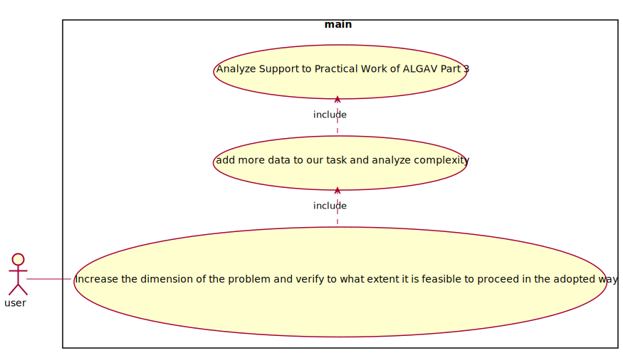

<div hidden>
```

@startuml UC3  
left to right direction  
skinparam packageStyle rectangle  
actor user  
rectangle main {
  user -- (Increase the dimension of the problem and verify to what extent it is feasible to proceed in the adopted way)  
  (Increase the dimension of the problem and verify to what extent it is feasible to proceed in the adopted way) .> (add more data to our task and analyze complexity) : include  
  (add more data to our task and analyze complexity) .> (Analyze Support to Practical Work of ALGAV Part 3) : include  
}  
@enduml  

```

</div>


