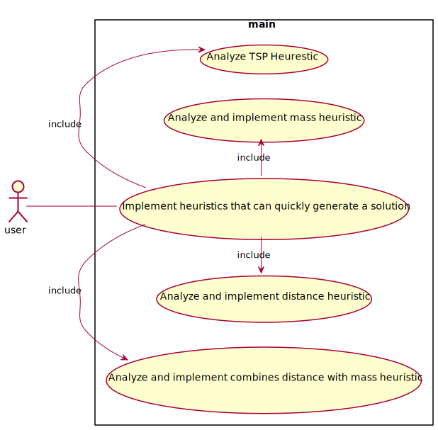

<div hidden>
```

@startuml UC4  
left to right direction  
skinparam packageStyle rectangle  
actor user  
rectangle main {
  user -- (Implement heuristics that can quickly generate a solution )  
  (Implement heuristics that can quickly generate a solution ) -right-> (Analyze TSP Heurestic) : include  
(Implement heuristics that can quickly generate a solution ) -left-> (Analyze and implement distance heuristic) : include  
(Implement heuristics that can quickly generate a solution ) -right-> (Analyze and implement mass heuristic) : include  
(Implement heuristics that can quickly generate a solution ) -left-> (Analyze and implement combines distance with mass heuristic) : include  
}  
@enduml
```

</div>


